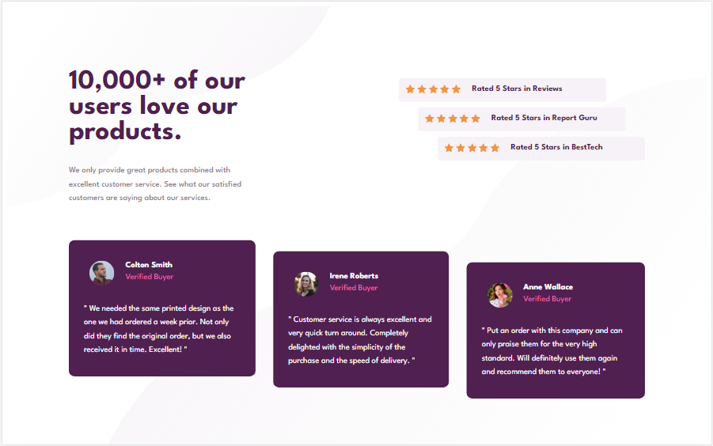

# Frontend Mentor - Social proof section solution
# Assignment by Web3bridge 

## Table of contents

- [Overview](#overview)
  - [Screenshot](#screenshot)
  - [Links](#links)
  - [Built with](#built-with)

### overview! 👋
Thanks for checking out this front-end coding challenge.
This is a solution to the [Social proof section challenge on Frontend Mentor](https://www.frontendmentor.io/challenges/social-proof-section-6e0qTv_bA). Frontend Mentor challenges help you improve your coding skills by building realistic projects. 

This project was taken as an assignment issued by Web3bridge.

### Screenshot

### Links

- Solution URL: [Add solution URL here](https://github.com/Nonnyjoe/social-proof-section-master)
- Live Site URL: [Add live site URL here](https://nonnyjoe.github.io/social-proof-section-master/)

### Built with

- Semantic HTML5 markup
- CSS custom properties
- Flexbox
- CSS Grid.
